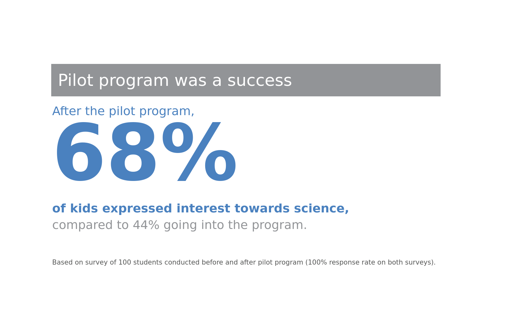

# storytelling-with-data
An implementation of http://www.storytellingwithdata.com/book/

## Simple Text
[Figure 9.29](notebooks/01_simple_text.ipynb)|
:-----------------------------:|
|

# How to setup env

1. Download and install miniconda:

    https://docs.conda.io/en/latest/miniconda.html

2. Clone **https://github.com/frannievas/storytelling-with-data** this repo

3. Create environment from `.yml` file

```shell
conda env create -f environment.yml
```

4. Activate environment

```shell
conda activate conda activate storytelling-with-data
```

4. Open jupyter notebook on a terminal and navigate to the `notebooks/` folder

```shell
$> jupyter notebook
```

# Colors
## Gray
|#231F20  GRAY1. Thunder         |#414040  GRAY2. Tundora          |#555655  GRAY3. Nandor           |#646369  GRAY4. Mid Gray         |#76787B  GRAY5. Rolling Stone    |#828282  GRAY6. Gray             |#929497  GRAY7. Oslo Gray        |#A6A6A5  GRAY8. Delta            |#BFBEBE  GRAY9. Silver           |
:-------------------------------:|:-------------------------------:|:-------------------------------:|:-------------------------------:|:-------------------------------:|:-------------------------------:|:-------------------------------:|:-------------------------------:|:-------------------------------:|
|||||||||

## Blue
|#174A7E  BLUE1. Chathams Blue   |#4A81BF  BLUE2. Steel Blue       |#94B2D7  BLUE3. Polo Blue        |#94AFC5  BLUE4. Nepal            |                                  |                                  |                                  |                                  |                                  |
:-------------------------------:|:-------------------------------:|:-------------------------------:|:-------------------------------:|:--------------------------------:|:--------------------------------:|:--------------------------------:|:--------------------------------:|:--------------------------------:|
|||||||||

## RED
|#C3514E  RED1. Fuzzy Wuzzy Brown|#E6BAB7  RED2. Rose Fog          |                                  |                                  |                                  |                                  |                                  |                                  |                                  |
:-------------------------------:|:-------------------------------:|:--------------------------------:|:--------------------------------:|:--------------------------------:|:--------------------------------:|:--------------------------------:|:--------------------------------:|:--------------------------------:|
  |  ||||||||


## GREEN
|#0C8040  GREEN1. Salem            |#9ABB59  GREEN2. Celery            |                                  |                                  |                                  |                                  |                                  |                                  |                                  |
:---------------------------------:|:---------------------------------:|:--------------------------------:|:--------------------------------:|:--------------------------------:|:--------------------------------:|:--------------------------------:|:--------------------------------:|:--------------------------------:|
|||||||||


## ORANGE
|#F79747  ORANGE1. Tan Hide          |                                  |                                  |                                  |                                  |                                  |                                  |                                  |                                  |
:-----------------------------------:|:--------------------------------:|:--------------------------------:|:--------------------------------:|:--------------------------------:|:--------------------------------:|:--------------------------------:|:--------------------------------:|:--------------------------------:|
|||||||||